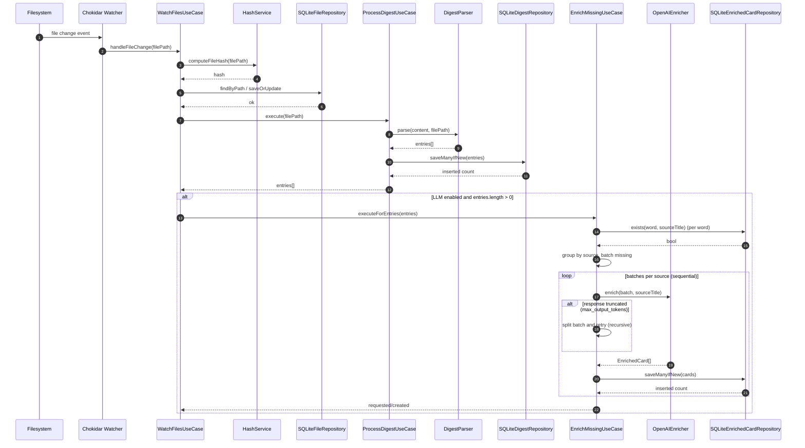
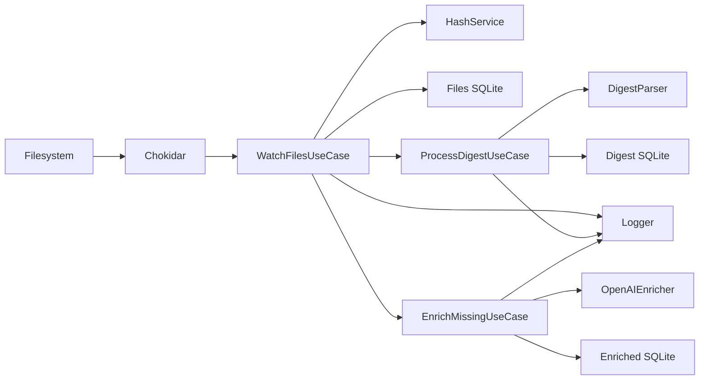

# SuperAnki AI — Pipeline (sequential, event‑driven)

Personal notes on how the pipeline is wired. A single file change is the trigger; the rest runs in order for that file.

## UML Sequence (per file change)



## Order of operations (per file event)

1) Compute hash → compare with last seen
2) Upsert file record (so repeated changes don’t blow up on UNIQUE)
3) Parse digest and write new entries to `digest_entries` (INSERT OR IGNORE)
4) If LLM is enabled, enrich missing words for each source (book filename) and upsert to `enriched_cards`

The watcher processes events sequentially; enrichment batches for the same source are handled sequentially to keep SQLite happy.

## Key parts

**WatchFilesUseCase**
- Wires `chokidar` with `WATCH_PATTERN`, `WATCH_DIRECTORY`, `WATCH_DEBOUNCE_MS`.
- For each event, runs hash → DB upsert → digest processing → optional enrichment.
- Times each stage with the project logger.

**ProcessDigestUseCase**
- Reads the file, parses Supernote‑style entries (word + `[book](Document/book)`), and writes with `INSERT OR IGNORE` inside a transaction.
- Returns parsed entries so the enrichment stage can decide what’s missing.

**EnrichMissingUseCase**
- Groups unique words by `sourceTitle` (book filename).
- Filters out already‑enriched `(word, source)` pairs via `SQLiteEnrichedCardRepository.exists`.
- Batches missing words by `LLM_BATCH_SIZE` and processes batches sequentially.
- On “max output tokens” from the model, splits the batch and retries recursively until it succeeds (down to single words if needed).

**OpenAIEnricher**
- Uses the Responses API with JSON‑schema‑formatted text output.
- Timeout guard ~60s; refusal detection; parse from `output[0].content[type=output_text]` or `output_text` fallback.
- Token budget: starts at `max(4096, 1000 + 200*words)`; one retry with a higher cap (up to 16384). Logs status/usage.
- Maps validated JSON into `EnrichedCard` rows.

**Logging**
- `ConsoleLogger` writes to console and (optionally) a file (`LOG_FILE`).
- Rotation can be `none`, `daily`, or `size` with retention (`LOG_MAX_*`).
- Timers are emitted as info lines; missing timer ends show up as warnings.

## Tables (created on first run)

- `files(path PRIMARY KEY, hash, last_seen)`
- `digest_entries(word PRIMARY KEY, book_filename, source_file, created_at)`
- `enriched_cards(word, source_title, canonical_answer, canonical_answer_alt, part_of_speech, definition, example_sentence, hint, created_at, updated_at, UNIQUE(word, source_title))`

Note: `digest_entries` uses `word` as PK (simple, matches current export). If collisions across books become an issue, this can evolve to a composite key.

## Config knobs

- Watcher: `WATCH_DIRECTORY`, `WATCH_PATTERN`, `WATCH_DEBOUNCE_MS`
- DB: `DATABASE_PATH`
- LLM: `LLM_ENABLED`, `LLM_MODEL`, `LLM_BATCH_SIZE`, `LLM_CONCURRENCY`, `OPENAI_API_KEY`, `OPENAI_BASE_URL`
- Logs: `LOG_LEVEL`, `LOG_FILE`, `LOG_ROTATE`, `LOG_MAX_SIZE_MB`, `LOG_MAX_FILES`

## Error/edge handling

- Digest parsing errors and DB write errors are logged and bubble from their use cases.
- LLM timeouts, refusal, and rate‑limit/quota messages are surfaced; token‑limit truncation triggers split‑and‑retry.
- Concurrency is kept low; batches are serialized per source to avoid transaction conflicts.

## Quick inspect

## UML Components (simplified)



```
sqlite3 ./data/app.db
.headers on
.mode box
.tables
.schema enriched_cards
SELECT word, source_title, part_of_speech, updated_at FROM enriched_cards ORDER BY updated_at DESC LIMIT 10;
```
